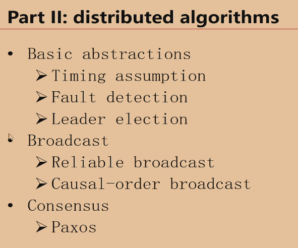
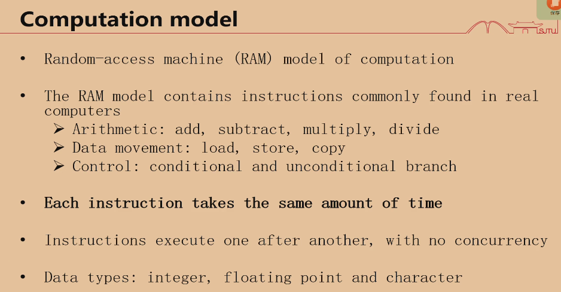

串行算法和并行算法

**Sequential algorithm**（串行算法）是一种按照严格的步骤顺序依次执行的算法。在这种算法中，任务是逐步完成的，每一个操作都必须等待前一个操作完成后才能执行。其特点是在某一时刻只能有一个操作在进行，这意味着计算的过程是线性的、单线程的。

**特点**：
1. **线性执行**：每个步骤严格按照顺序执行，没有并发或并行的操作。
2. **简单性**：实现和调试相对容易，因为不存在多任务处理或同步问题。
3. **资源利用率较低**：无法充分利用多核处理器的优势，计算能力通常是处理器单核的性能上限。

**示例**：
假设有一个算法要计算数组中所有元素的总和，顺序算法会像这样依次遍历数组：

```python
def sequential_sum(arr):
    total = 0
    for num in arr:
        total += num
    return total
```

在这个示例中，每一次加法操作必须等到上一次操作完成后才进行，所有操作按顺序进行。

**应用场景**：
Sequential algorithms适用于任务规模较小、计算不复杂，或不需要并发执行的情况。随着计算机多核处理器的普及，对于大规模数据或复杂任务，越来越多的场景会转向使用并行算法来提高性能。

1. **串行算法**（Serial Algorithm）：串行算法是按顺序执行的，任务中的每一步都依次执行，不能同时进行多个步骤。处理器一次只能执行一个任务，任务完成之后再执行下一个任务。这是传统的计算方式，常见于单核处理器的计算机中。

   - 优点：实现简单，调试容易。
   - 缺点：效率低，尤其在处理复杂、大规模任务时速度较慢。

2. **并行算法**（Parallel Algorithm）：并行算法则是将任务分成若干个部分，这些部分可以同时在多个处理器或多个计算核心上并行执行。这种方法利用了多核处理器或分布式计算资源，大大提高了计算效率。

   - 优点：在处理大规模数据或复杂问题时，能够显著提高效率和计算速度。
   - 缺点：实现较复杂，涉及多线程、同步问题，调试和维护难度较高。

因此，串行算法和并行算法主要的区别在于任务执行的顺序和方式：串行算法是按顺序逐一执行的，而并行算法可以同时执行多个任务。并行算法往往适合需要处理大量数据或者需要在较短时间内完成任务的场景。

分布式算法

开卷考试

教材：

M@IB5V.png)



这张图是关于**分布式算法**（Distributed Algorithms）的内容概要，列出了分布式算法中的一些基础概念和重要的算法类型。下面对图中的每个部分做一个解释：

### 1. **Basic Abstractions**（基础抽象概念）
   - **Timing Assumption**（时间假设）：在分布式系统中，节点之间通信和操作会有延迟。不同的分布式算法对延迟有不同的假设，比如同步系统（假设有界延迟）和异步系统（不假设有界延迟）。这会影响算法设计的复杂性。
   - **Fault Detection**（故障检测）：分布式系统的节点可能出现故障，故障检测机制用于检测和处理这些故障，确保系统能继续运行。故障可能是节点崩溃、网络中断等。
   - **Leader Election**（领导者选举）：在分布式系统中，通常需要选举出一个领导者（Leader），负责协调其他节点的行为。领导者选举算法用于确保系统中的节点能在需要时达成一致，选出一个唯一的领导者。

### 2. **Broadcast**（广播）
   - **Reliable Broadcast**（可靠广播）：确保消息能被所有正确的节点可靠地接收到，即使系统中的某些节点或网络发生了故障。
   - **Causal-order Broadcast**（因果顺序广播）：确保消息的传递顺序遵循因果关系。即如果一个消息A的发生因果先于消息B，那么所有节点接收到这两个消息的顺序也应该是先A后B。

### 3. **Consensus**（共识）
   - **Paxos**：Paxos 是分布式系统中最著名的共识算法之一，用于确保分布式系统中的节点就某个值达成一致。它能够在部分节点故障的情况下仍然确保系统能够达成共识。

### 总结
这张图概述了分布式算法的几个关键部分：
1. 基础抽象，包括时间假设、故障检测、领导者选举等。
2. 广播机制，重点在于可靠性和因果关系。
3. 共识算法，以Paxos为例，展示了在分布式系统中达成共识的算法。

这些都是构建和理解分布式系统时的重要概念。



这张图介绍了**计算模型**中的 **RAM 模型**（Random Access Machine，随机访问机器），这是计算复杂度分析中常用的抽象模型之一，用于模拟实际计算机的工作方式。下面对图中的各个部分进行解释：

### 1. **Random-access machine (RAM) model of computation**
   - **随机访问机器模型**：RAM 模型是一种计算机模型，用来描述算法的执行过程。在这个模型中，计算机可以随机访问内存中的任何位置，因此每个内存访问操作的时间是常数时间。

### 2. **Instructions in the RAM model**（RAM 模型中的指令）
   - RAM 模型包含了一些现实计算机中常见的指令，主要包括三类：
     - **Arithmetic**（算术运算）：加法、减法、乘法、除法等基本算术操作。
     - **Data movement**（数据移动）：数据加载、存储、复制等操作。
     - **Control**（控制操作）：条件分支和无条件分支控制流。

### 3. **Each instruction takes the same amount of time**
   - **每条指令的执行时间相同**：在 RAM 模型中，所有指令（无论是算术运算、数据移动还是控制流操作）都假设在相同的常数时间内完成。这一假设简化了计算模型的分析，方便算法的时间复杂度计算。

### 4. **Instructions execute one after another, with no concurrency**
   - **指令按顺序执行，没有并发**：RAM 模型假设指令是串行执行的，即每次只有一条指令在执行，当前指令执行完毕后才能开始下一条指令。这与并行计算模型不同。

### 5. **Data types: integer, floating point and character**
   - **数据类型**：RAM 模型中的数据类型包括整数（integer）、浮点数（floating point）和字符（character），这些是程序设计中常见的基础数据类型。

### 总结
这张图的核心内容是解释 RAM 模型的基本特点，它是一个理想化的计算模型，用于分析算法的时间复杂度和空间复杂度。它假设所有指令执行时间一致，指令按顺序执行，并且支持常见的算术运算、数据移动和控制操作。RAM 模型被广泛用于算法设计和分析，是许多算法理论研究的基础。

**控制操作**中的**条件分支**和**无条件分支**是控制程序执行流程的基本概念，它们在程序设计和算法执行中起着关键作用。下面详细解释：

### 1. **条件分支**（Conditional Branch）

条件分支是程序根据某个条件的真假来决定接下来执行哪部分代码的控制方式。程序会在执行时判断某个布尔表达式或条件是否为真，然后根据结果选择不同的路径。

- **典型形式**：`if` 语句或 `switch-case` 语句。
  
  - **`if` 语句**：根据条件的真假，选择执行一个代码块或跳过。
    - 例子：
      ```python
      if x > 0:
          print("x is positive")
      else:
          print("x is not positive")
      ```
      这里程序会判断 `x > 0` 的真假：
      - 如果条件为真（`x` 大于 0），则执行 `print("x is positive")`；
      - 如果条件为假，则执行 `print("x is not positive")`。

- **作用**：条件分支允许程序具有决策能力，可以在不同的条件下执行不同的操作。它决定了程序执行的方向。

### 2. **无条件分支**（Unconditional Branch）

无条件分支是直接改变程序执行流，不依赖于任何条件的判断，程序会直接跳转到指定的代码位置继续执行。

- **典型形式**：`goto` 语句、`break` 和 `continue` 语句，或者函数调用。
  
  - **`goto`**：直接跳转到程序中的另一个标签位置继续执行（现代高级编程语言中较少使用）。
  - **`break`**：在循环或条件语句中，强制跳出循环或结束当前代码块的执行。
  - **`continue`**：跳过当前循环中的剩余代码，直接进入下一次循环。
  
  - 例子：
    ```python
    for i in range(5):
        if i == 3:
            break
        print(i)
    ```
    这里 `break` 是一种无条件分支操作，当 `i == 3` 时，程序直接跳出循环，不再继续执行剩下的循环。

- **作用**：无条件分支直接改变程序的执行流，允许程序跳转到指定的代码位置。它通常用于跳出循环、提前结束函数或程序，改变正常的执行流程。

### 总结

- **条件分支**是根据某个条件的真假来决定执行不同的代码路径，是程序中最常见的控制结构之一。
- **无条件分支**则是程序不依赖条件，直接跳转到指定位置继续执行。

在硬件或计算模型中，这些分支指令都通过跳转来实现，从而改变程序的执行流。在 RAM 模型中，这两类分支操作都是以常数时间（即固定的时间）执行的，用于控制程序的执行顺序。

区块链

**区块链**（Blockchain）是一种去中心化的分布式账本技术，通过加密算法和分布式共识机制，确保数据的安全、透明和不可篡改。最初，区块链是为比特币等加密货币设计的底层技术，但它的应用已扩展到许多其他领域。

### 区块链的基本概念和特点

1. **区块（Block）**：
   - 区块链由一系列的区块组成，每个区块包含一组交易或数据记录。
   - 区块包括两个关键部分：
     - **区块头**：包含元数据，如时间戳、前一个区块的哈希值等。
     - **区块体**：存储实际的数据或交易信息。

2. **链（Chain）**：
   - 区块通过加密的方式依次相连，形成链条。每个区块都包含前一个区块的哈希值，这确保了任何一个区块的数据无法篡改，否则会影响整个链的完整性。

3. **去中心化**：
   - 传统系统通常依赖一个中心化的第三方机构来记录和验证数据，而区块链通过分布式网络中所有节点的共同参与，不再需要中心化的信任机构。
   - 每个参与区块链的节点都保存一份完整的账本副本，所有节点协同工作来验证和更新数据。

4. **共识机制**：
   - 区块链依靠共识机制来确保网络中的各个节点达成一致。常见的共识机制包括：
     - **工作量证明（PoW，Proof of Work）**：矿工通过计算复杂的数学问题来竞争生成新块。
     - **权益证明（PoS，Proof of Stake）**：根据节点持有的代币数量和时间来决定谁有权生成新块。

5. **不可篡改性**：
   - 一旦数据记录在区块链上，除非后续的所有区块都被重新计算，否则无法轻易篡改或删除，这使得区块链的记录非常安全。

6. **透明和可追溯性**：
   - 区块链上的交易记录是公开透明的，任何人都可以查看交易记录，同时所有数据是按时间顺序排列的，方便追溯历史交易。

### 区块链的主要应用

1. **加密货币**：
   - 最广为人知的区块链应用是比特币和以太坊等加密货币。这些货币利用区块链技术实现了点对点的电子现金交易系统，不依赖银行等传统金融机构。

2. **智能合约**：
   - 在以太坊等区块链平台上，**智能合约**（Smart Contracts）是一种自动执行合同条件的代码，可以用来自动化复杂的交易或合约执行，不需要中介。

3. **供应链管理**：
   - 区块链可以帮助记录商品从原材料到最终交付给消费者的每一步操作，确保供应链的透明和可追溯性。

4. **数字身份**：
   - 区块链可以为个人提供安全的、不可篡改的数字身份，避免身份信息泄露。

5. **去中心化金融（DeFi）**：
   - DeFi通过区块链技术提供传统金融服务的替代方案，如借贷、交易和保险，而不需要传统的银行或金融机构作为中介。

### 总结
区块链是一种革命性的技术，通过去中心化、不可篡改、透明和安全的特性，改变了许多行业的运作方式。它不仅应用于加密货币，还广泛应用于供应链、金融、身份管理等领域，未来可能会有更多的创新和扩展。

**选择排序**（Selection Sort）是一种简单直观的排序算法。它的工作原理是每次从未排序部分中选择最小（或最大）的元素，将其与未排序部分的第一个元素交换，逐步扩大已排序部分，直到整个数组有序。

### 选择排序的过程如下：

1. **初始化**：假设要排序的数组有 `n` 个元素。最开始，整个数组是未排序的。
2. **遍历未排序部分**：从未排序部分中找到最小（或最大）的元素。
3. **交换**：将找到的最小元素与当前未排序部分的第一个元素交换。
4. **缩小未排序部分**：从未排序部分的下一个元素开始，重复步骤2和3，直到所有元素都排好序。

### 详细步骤举例

假设我们要对数组 `arr = [64, 25, 12, 22, 11]` 进行升序排序，选择排序的过程如下：

- **第一轮**（i=0）：
  - 找到未排序部分 `[64, 25, 12, 22, 11]` 中的最小值 `11`。
  - 交换 `11` 和第一个元素 `64`，数组变为 `[11, 25, 12, 22, 64]`。
  - 已排序部分为 `[11]`，未排序部分为 `[25, 12, 22, 64]`。

- **第二轮**（i=1）：
  - 找到未排序部分 `[25, 12, 22, 64]` 中的最小值 `12`。
  - 交换 `12` 和第二个元素 `25`，数组变为 `[11, 12, 25, 22, 64]`。
  - 已排序部分为 `[11, 12]`，未排序部分为 `[25, 22, 64]`。

- **第三轮**（i=2）：
  - 找到未排序部分 `[25, 22, 64]` 中的最小值 `22`。
  - 交换 `22` 和第三个元素 `25`，数组变为 `[11, 12, 22, 25, 64]`。
  - 已排序部分为 `[11, 12, 22]`，未排序部分为 `[25, 64]`。

- **第四轮**（i=3）：
  - 找到未排序部分 `[25, 64]` 中的最小值 `25`。
  - 不需要交换，数组保持不变 `[11, 12, 22, 25, 64]`。
  - 已排序部分为 `[11, 12, 22, 25]`，未排序部分为 `[64]`。

- **第五轮**（i=4）：
  - 剩下最后一个元素 `64` 已经在正确的位置，不需要操作。

最终数组变为 `[11, 12, 22, 25, 64]`，排序完成。

### 伪代码

```python
def selection_sort(arr):
    n = len(arr)
    for i in range(n):
        min_idx = i
        # 找到未排序部分中的最小值
        for j in range(i+1, n):
            if arr[j] < arr[min_idx]:
                min_idx = j
        # 交换找到的最小值和未排序部分的第一个元素
        arr[i], arr[min_idx] = arr[min_idx], arr[i]
```

### 时间复杂度
- **时间复杂度**：选择排序的时间复杂度为 **O(n²)**，因为有两个嵌套的循环，一个遍历整个数组，另一个遍历未排序部分。
- **空间复杂度**：选择排序的空间复杂度为 **O(1)**，因为它是就地排序算法，不需要额外的空间。

### 适用场景
选择排序适用于数组较小或需要空间复杂度很低的情况。然而，由于其时间复杂度较高，在处理大规模数据时效率较低，因此通常不适合排序大型数据集。

**插入排序**（Insertion Sort）是一种简单的排序算法，其工作原理是将数据划分为已排序和未排序两部分，然后逐一将未排序部分的元素插入到已排序部分的合适位置，从而得到有序的数组。

### 插入排序的过程：

1. **初始化**：假设第一个元素已经是已排序部分。
2. **遍历未排序部分**：从第二个元素开始（即数组的第一个未排序元素），逐一将每个元素插入到已排序部分的正确位置。
3. **插入操作**：对于每一个未排序元素，从后往前依次比较它与已排序部分的元素，如果比当前元素小，就向后移动当前已排序元素，直到找到合适位置插入该元素。

### 插入排序举例

假设有一个数组 `arr = [12, 11, 13, 5, 6]`，插入排序的过程如下：

- **第一轮**（i=1）：
  - 取出第二个元素 `11`，与第一个元素 `12` 比较。
  - `11` 小于 `12`，将 `12` 向右移，插入 `11`。
  - 数组变为 `[11, 12, 13, 5, 6]`。

- **第二轮**（i=2）：
  - 取出第三个元素 `13`，与已排序部分 `[11, 12]` 比较。
  - `13` 大于 `12`，保持不变，插入在当前位置。
  - 数组保持不变 `[11, 12, 13, 5, 6]`。

- **第三轮**（i=3）：
  - 取出第四个元素 `5`，与已排序部分 `[11, 12, 13]` 依次比较。
  - `5` 小于 `13`，将 `13` 向右移；
  - `5` 小于 `12`，将 `12` 向右移；
  - `5` 小于 `11`，将 `11` 向右移；
  - 将 `5` 插入到第一个位置。
  - 数组变为 `[5, 11, 12, 13, 6]`。

- **第四轮**（i=4）：
  - 取出第五个元素 `6`，与已排序部分 `[5, 11, 12, 13]` 依次比较。
  - `6` 小于 `13`，将 `13` 向右移；
  - `6` 小于 `12`，将 `12` 向右移；
  - `6` 小于 `11`，将 `11` 向右移；
  - 将 `6` 插入到第二个位置。
  - 数组变为 `[5, 6, 11, 12, 13]`。

经过四轮插入，数组已经排序完毕，最终结果为 `[5, 6, 11, 12, 13]`。

### 插入排序的伪代码

```python
def insertion_sort(arr):
    # 从第二个元素开始，因为第一个元素默认是已排序部分
    for i in range(1, len(arr)):
        key = arr[i]  # 未排序部分的第一个元素
        j = i - 1
        
        # 向左遍历已排序部分，找到插入位置
        while j >= 0 and key < arr[j]:
            arr[j + 1] = arr[j]  # 将元素右移
            j -= 1
        
        arr[j + 1] = key  # 插入到正确位置
```

### 时间复杂度
- **平均情况和最坏情况时间复杂度**：O(n²)，因为在最坏情况下，每个元素都需要与之前的所有元素进行比较和移动。
- **最好情况时间复杂度**：O(n)，当数组已经排序时，每次比较只需一次操作，无需移动元素。
- **空间复杂度**：O(1)，因为插入排序是就地排序，不需要额外的内存空间。

### 插入排序的特点
1. **简单易懂**：插入排序的逻辑非常简单，容易实现。
2. **适用于小规模数据集**：插入排序在处理小型数据集时非常有效。
3. **适用于部分有序的数据**：如果数据已经基本有序，插入排序的效率会比较高，接近线性时间。
4. **稳定性**：插入排序是一个稳定的排序算法，即如果两个元素的值相同，排序后它们的相对顺序保持不变。

### 适用场景
插入排序适用于数据量较小或已基本有序的数据集。如果数据规模较大或者无序程度较高，插入排序的效率就会比较低，不适合用于这些场景。